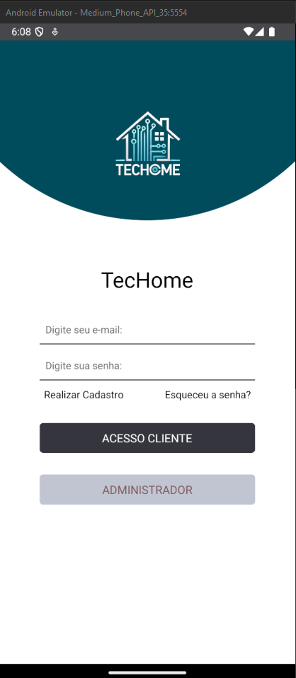
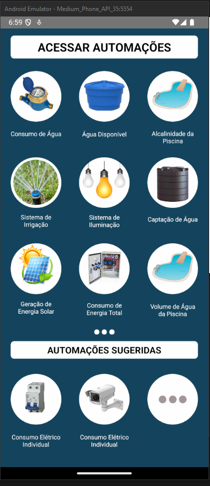
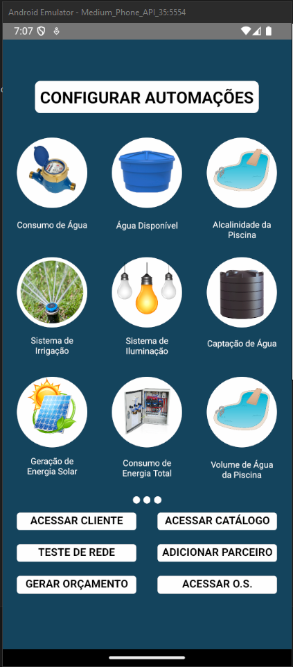
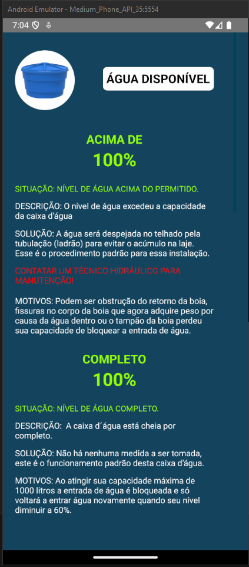

# TecHome
Este projeto de App foi desenvolvido como parte de um trabalho acadêmico, com o conceito de uma empresa voltada para automações residenciais. Inicialmente, foi solicitado apenas o desenvolvimento do layout no Figma. No entanto, decidi ir além e criar um protótipo funcional do aplicativo, desenvolvendo o front-end para ser apresentado em aula.

## Tecnologia Utilizada
- Figma: Desenho e planejamento do Aplicativo
- React-Native com cli: Desenvolvimento do App

## Responsável pelo design
Todo o design do aplicativo foi criado pelo meu colega **Kleber Ramon**, que atuou como UX designer.  
Link do projeto no Figma: https://www.figma.com/design/o8cvJmTscgxzLcghttIi6t/TecHouse?node-id=0-1&t=Uzbci5TX9XtcCt8m-1

# Telas
## Tela de Login:
Tela de login do sistema, onde o usuário insere seu e-mail e senha. Além disso, há opções para criar uma nova conta, caso ainda não possua, e para recuperar a senha, caso tenha esquecido.  
Se o usuário for nível administrador, ele poderá acessar funcionalidades exclusivas.  

## Home do Cliente:
Essa é uma tela com todas as automações disponíveis do cliente.  
OBS: Nesse protótipo, apenas a automação Água Disponível possui clique.  

## Home Administrador
Esta é a tela inicial, onde o usuário tem acesso à área de administração, que contém funcionalidades exclusivas e restritas.

## Detalhes da Automação:
Nesta seção do sistema, é possível visualizar os detalhes da automação, como os níveis da caixa d'água.

